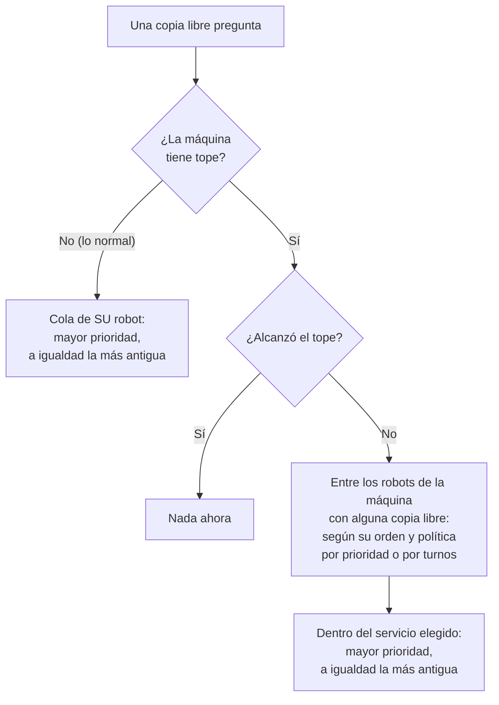
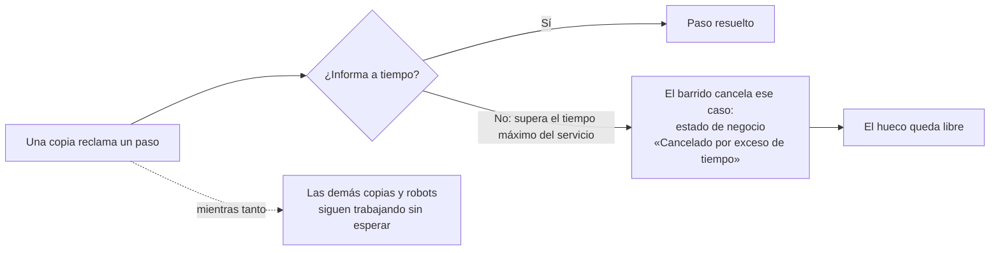

# El despachador, de un vistazo

Cómo reparte Viriato el trabajo entre los robots. Es un modelo **de tirón** (*pull*): la plataforma nunca empuja nada a un robot;
cada **copia** de un robot pregunta «¿tienes algo para mí?» cuando está libre, y la plataforma decide en ese momento, con un solo
árbitro, qué le toca. Los detalles y las razones están en [despacho-por-instancias.md](despacho-por-instancias.md) y
[despacho-por-equipo.md](despacho-por-equipo.md); esto es el mapa.

## Las piezas

```
  Proceso (flujo)              Servicio                    Equipo (máquina)
  ┌──────────────┐  paso Rpa   ┌─────────────┐  despliegue  ┌──────────────────────┐
  │ Paso 1 …     │───────────▶ │ «Extractor» │◀─────────────│ «PC-oficina»         │
  │ Paso 2 (Rpa) │             │ tiempo máx. │  (= un robot │  orden y política    │
  └──────────────┘             │ límite glob.│   + su clave)│  tope opcional       │
                               └─────────────┘              └──────────────────────┘
                                                                     ▲
                                              copias (procesos / réplicas del contenedor)
                                              ┌──────────┬──────────┬──────────┐
                                              │ copia a  │ copia b  │ copia c  │  ← mismo robot, misma clave,
                                              └──────────┴──────────┴──────────┘    distinto id (X-Viriato-Instancia)
```

- Un **paso Rpa** de un proceso dice qué **servicio** lo hace. Cada vez que un caso llega a ese paso nace una **ejecución** en la cola
  de ese servicio, con su **prioridad** (0 por defecto).
- Un **despliegue** une un servicio con un equipo y con un proceso, y da la **clave** del robot. Un robot = un despliegue.
- Un robot puede correr como **varias copias**. La capacidad **no se configura**: es cuántas copias hay en marcha (réplicas en el
  stack o procesos en Windows con la misma clave). Cada copia aparece sola al pedir trabajo.

## Una petición, paso a paso

```mermaid
sequenceDiagram
    autonumber
    participant R as Copia del robot
    participant A as API (cerrojo de despacho)
    participant BD as Base de datos

    R->>A: POST /rpa/cola/siguiente  (X-Api-Key + X-Viriato-Instancia)
    A->>BD: cerrojo: una decisión a la vez en toda la plataforma
    A->>BD: apunta la copia (despliegue + id + hora)
    alt la copia ya tiene un paso en ejecución
        A-->>R: 204 nada ahora
    else el servicio está en su límite global
        A-->>R: 204 nada ahora
    else la máquina tiene tope y está llena
        A-->>R: 204 nada ahora
    else
        A->>BD: elige la ejecución (ver abajo) y la reclama
        A-->>R: 200 el paso
    end
    Note over R,A: la copia ejecuta y avisa del resultado; mientras tanto no vuelve a pedir
```

## Qué se le da a quien pregunta



- **Sin tope**: cada robot trabaja su propia cola. Varias copias del mismo robot se reparten esa cola **en orden estricto** (es una sola
  decisión atómica; hay un test con 4 copias y 6 prioridades distintas).
- **Con tope** (para robots que comparten pantalla o navegador): la máquina decide qué servicio va primero (por prioridad de lista o por
  turnos) y dentro de él manda la prioridad de cada ejecución.

## Cuando algo se cuelga



- No hay latidos ni «estoy vivo»: la única regla es el **tiempo máximo del servicio**. Un paso que se pasa **deja de ocupar el hueco** al
  instante, aunque el barrido (cada 15 s) todavía no lo haya cancelado.
- Una copia atascada solo ocupa **su** hueco; no frena a las demás copias ni a otros robots.
- Una copia que muere deja su paso reclamado hasta que se acaba el tiempo máximo; una copia nueva llega con otro id y trabaja al momento.
- Un servicio **sin tiempo máximo** no se cancela nunca por tardar: si su robot muere, ese hueco queda ocupado hasta que alguien
  cancele o reprocese el paso. Conviene ponerlo siempre.

## Quién decide qué

| Pregunta | La decide | Dónde se cambia |
|---|---|---|
| ¿Cuántos robots a la vez? | Las **copias** que haya en marcha | El stack (`replicas`, `--scale`) o arrancar más procesos |
| ¿Qué servicio atiende cada copia? | Su **clave** de despliegue | La configuración de la copia (no una pantalla) |
| ¿Qué va antes dentro de un servicio? | La **prioridad** de la ejecución, luego la antigüedad | Al crear el caso (robot) o en la pestaña *Ejecuciones* (`casos.prioridad`) |
| ¿Qué servicio va antes en una máquina con tope? | Orden y política del **equipo** | *Equipos → Despacho* (`rpa.despacho`) |
| ¿Cuánto puede tardar un paso? | El **tiempo máximo del servicio** | *Servicios* |
| ¿Cuántos de un servicio en toda la flota? | El **límite global** del servicio | *Servicios* |

## Escalar

- **Contenedores**: `docker compose up -d --scale <robot>=3` (o `deploy.replicas: 3`). Todas las réplicas llevan la misma `Viriato__ApiKey`.
- **Windows**: otro proceso del robot con la misma clave. Si un proceso aloja varios robots, un `Viriato:InstanciaId` distinto para cada uno.
- Los robots hablan con la API por HTTP (`Viriato:BaseUrl`); pueden estar en la misma máquina que la plataforma, en otra de tu red o fuera,
  siempre que lleguen a la dirección pública ([despliegue-en-real.md](despliegue-en-real.md)).
